# FadeUp — Target Domain Model (as of R1)

This is the domain model **as it actually exists** after R1, not an aspiration.
Every table and column named here was read from `pg_catalog` on a database
built by replaying the full migration chain.

Items marked **NEW** were introduced by R1. Everything else already existed.

---

## 1. Identity

The single most important thing to understand: FadeUp separates several things
that products of this kind usually collapse into one table.

| Concept | Table | Scope |
| --- | --- | --- |
| Authentication identity | `auth.users` | who can log in |
| Account identity | `profiles` | bare, not org-scoped |
| Customer identity (private) | `customer_profiles` | customer-owned, portable, org-agnostic |
| Customer identity (public) | `customer_public_profiles` **NEW** | opt-in projection |
| Professional identity | `professionals` **NEW** | durable, org-INDEPENDENT |
| Business membership | `memberships` + `staff_profiles` | per (org, user) |
| Operational barber record | `barbers` | per org, cascades with it |
| Shop CRM contact | `customers` | per org, staff-owned |

`professionals` is what R1 exists for. Before it, a professional's public
identity *was* `barbers.id` — a row that cascades from both `organizations` and
`staff_profiles`, so changing shop destroyed the identity, and an
externally-discovered professional could not have one at all.

---

## 2. Diagram

```mermaid
erDiagram
    AUTH_USERS ||--o| PROFILES : "account"
    AUTH_USERS ||--o| CUSTOMER_PROFILES : "private customer identity"
    AUTH_USERS ||--o| CUSTOMER_PUBLIC_PROFILES : "opt-in public projection (NEW)"
    AUTH_USERS ||--o| CUSTOMER_PASSPORTS : "exactly one Fade Passport"
    AUTH_USERS ||--o| PROFESSIONALS : "claims at most one identity (NEW)"

    CUSTOMER_PASSPORTS ||--o{ CUSTOMER_PASSPORT_PHOTOS : "reference photos"
    CUSTOMER_PASSPORTS ||--o{ CUSTOMER_PASSPORT_SHARES : "revocable share links"

    ORGANIZATIONS ||--o{ LOCATIONS : "has"
    ORGANIZATIONS ||--o{ MEMBERSHIPS : "authorization"
    ORGANIZATIONS ||--o{ STAFF_PROFILES : "roster"
    ORGANIZATIONS ||--o{ SERVICES : "offers"
    ORGANIZATIONS ||--o{ CUSTOMERS : "CRM contacts"

    AUTH_USERS ||--o{ MEMBERSHIPS : "member of"
    MEMBERSHIPS ||--|| STAFF_PROFILES : "auto-provisions"
    STAFF_PROFILES ||--o| BARBERS : "is a bookable barber"

    PROFESSIONALS ||--o{ BARBERS : "one identity, many shop rows (NEW link)"

    BARBERS ||--o{ APPOINTMENTS : "serves"
    BARBERS ||--o{ QUEUE_ENTRIES : "serves"
    LOCATIONS ||--o{ APPOINTMENTS : "at"
    LOCATIONS ||--o{ QUEUE_ENTRIES : "at"
    CUSTOMERS ||--o{ APPOINTMENTS : "for"
    CUSTOMERS ||--o{ QUEUE_ENTRIES : "for"
    AUTH_USERS ||--o{ APPOINTMENTS : "booked_by_user_id (NEW, provenance)"
    AUTH_USERS ||--o{ QUEUE_ENTRIES : "booked_by_user_id (NEW, provenance)"

    AUTH_USERS ||--o{ PROFESSIONAL_FOLLOWS : "follows (NEW)"
    PROFESSIONALS ||--o{ PROFESSIONAL_FOLLOWS : "followed by (NEW)"

    AUTH_USERS ||--o{ CUSTOMER_PROFESSIONAL_RELATIONSHIPS : "genuine client of (NEW)"
    PROFESSIONALS ||--o{ CUSTOMER_PROFESSIONAL_RELATIONSHIPS : "has served (NEW)"
    ORGANIZATIONS ||--o{ CUSTOMER_PROFESSIONAL_RELATIONSHIPS : "where it happened (NEW)"

    CUSTOMER_PROFESSIONAL_RELATIONSHIPS ||--o| PROFESSIONAL_CLIENT_SHOWCASES : "may be published, with consent (NEW)"
    PROFESSIONALS ||--o{ PROFESSIONAL_CLIENT_SHOWCASES : "requests (NEW)"
    AUTH_USERS ||--o{ PROFESSIONAL_CLIENT_SHOWCASES : "consents (NEW)"

    PROSPECT_SOURCES ||--o{ PROSPECT_SOURCE_RECORDS : "observation"
    PROSPECT_SOURCE_RECORDS }o--o| PROSPECTS : "converges on canonical"
    PROSPECTS ||--o{ PROSPECT_IDENTITY_MATCHES : "match evidence"
    PROSPECTS ||--o{ PROSPECT_DUPLICATES : "unresolved candidates"
    PROSPECTS ||--o| PROFESSIONALS : "published as external profile (NEW link)"

    PROFESSIONALS ||--o{ PROFESSIONAL_PROFILE_CLAIMS : "claimed via (NEW)"
    AUTH_USERS ||--o{ PROFESSIONAL_PROFILE_CLAIMS : "claimant (NEW)"

    PLATFORM_MEMBERS ||--o{ PLATFORM_AUDIT_LOG : "decides and audits"
```



---

## 3. The flows that matter

### Follow (intent)

```
customer taps Follow            -> follow_professional()   -> state=following, source=manual
customer taps Unfollow          -> unfollow_professional() -> state=unfollowed, has_explicit_unfollow=TRUE
customer's own booking confirms -> try_auto_follow()       -> ON CONFLICT DO NOTHING
```

The last line is the whole invariant: auto-follow can only ever *create* an
edge, never overwrite one. An explicit unfollow is therefore permanent until
the customer manually follows again.

### Verified Client (evidence)

```
appointment.status -> 'completed'   ┐
                                    ├─> record_service_relationship()
queue_entry.status -> 'completed'   ┘      (customer, professional, ORGANIZATION)
```

Gated on `booked_by_user_id`, never on `customers.user_id`. A confirmed but
future appointment produces nothing. Follower and Verified Client have
completely separate sources of truth, and neither is derived from the other.

### Publishable social proof (permission)

```
genuine relationship  AND  consent approved by the CUSTOMER
                      AND  customer_public_profiles.is_public
                      AND  verification_state = 'verified'   (for the ✓, evaluated live)
                              -> list_public_professional_showcases()
```

The professional may only ever insert a `pending` request. Only the customer
moves consent, and `revoked` is terminal.

### Worker acquisition

```
prospect_sources -> prospect_source_records -> prospect_identity_matches
                                            -> prospects (canonical)
                                            -> professionals (source='worker', user_id NULL)
                                            -> professional_profile_claims
                                            -> professionals.user_id set (claimed)
```

R1 added only the last three arrows. Everything left of `prospects` already
existed.

---

## 4. Public / private data map (§82)

| Domain | Public | Customer private | Business private | Platform internal |
| --- | --- | --- | --- | --- |
| Professional identity | `display_name`, `handle`, `headline`, `bio`, `avatar_url`, verified flag, claimed flag, capped follower + verified-client counts — via `get_public_professional()` | — | operational rows on `barbers` (services, hours, availability) | `prospect_id`, `source`, raw `claim_state`, `verification_state` |
| Customer identity | `username`, `display_name`, `avatar_url`, `persona_category`, verified flag — **only** when `is_public` | `customer_profiles`: email, phone, style preferences, onboarding | `customers.notes` and the whole per-org CRM row | verification rationale in `platform_audit_log` |
| Fade Passport | nothing | whole passport + photos; share links expose a curated subset via token | — | `passport_number` (identifier, never an authenticator) |
| Social graph | follower **count** only (capped at 1000+) | the customer's own edges and `has_explicit_unfollow` | — | — |
| Customer↔professional relationship | existence only, as a count | the customer's own rows | rows for that organization only | — |
| Social proof | `display_name`, `username`, `avatar_url`, verified flag | consent state | — | — |
| Worker acquisition | nothing | — | — | every `prospect_*` table: observations, raw payloads, confidence, matching evidence, duplicates, scoring, outreach |
| Claims | nothing | the claimant's own claims | — | all claims, decisions, evidence |
| Booking / queue | availability only | own appointments via RPC | full operational rows | — |

Nothing in the "Public" column is readable by a direct table SELECT. Every
public value is served by a `SECURITY DEFINER` projection with an explicit
column list. There are **zero** RLS policies granting `anon` anywhere in the
database.

---

## 5. What R1 deliberately did not model

* No Apple/Google Wallet installation entity — a Passport exists whether or
  not it is installed on a device, and those are different lifecycles.
* No plan, price, subscription, tier or entitlement column anywhere.
* No follower **list** projection, only counts.
* No merge path between two `professionals` rows (see `DEPRECATIONS.md`).
* No new Worker observation, matching or dedupe structure — the existing
  pipeline already covers it.
* No availability, queue, schedule or booking capability on `professionals`,
  which is precisely what makes an unclaimed external profile safe.
